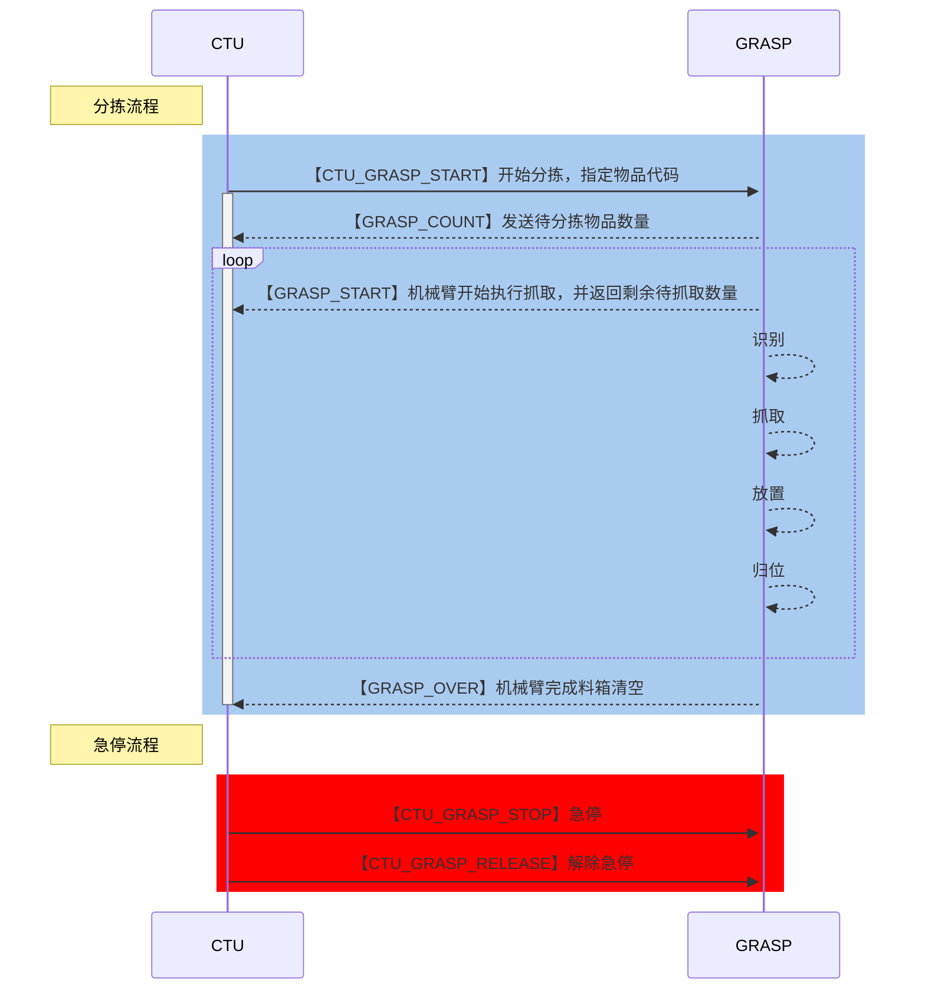
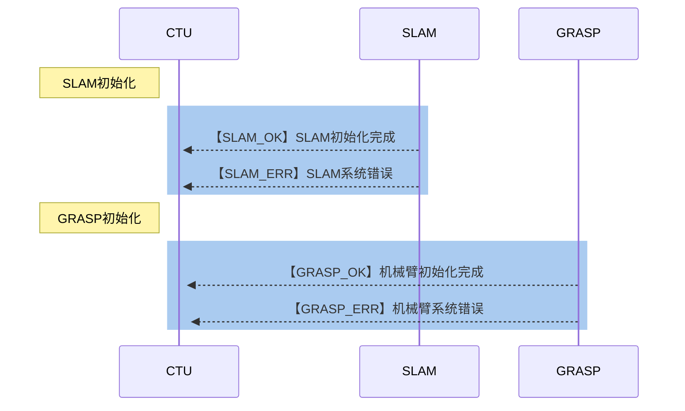

# CTU与上位机通信协议

## 设备通信地址
1. 上位机（开发板）
   1. 有线: 192.168.127.102
   2. 无线: 192.168.2.51（CMCC-92FZ）
2. 机械臂
   1. 有线: 192.168.127.101 
3. CTU
   1. 有线: 192.168.127.253 
   2. TCP通信端口: 8899

## 协议构成

通信协议中一段独立的数据帧由帧头、数据帧、校验和组成。字段是指一个一字节的数据。

**上位机：指开发板 Jetson Orin NX，运行了SLAM或机械臂分拣程序**

**下位机：例如STM32**


### 帧头

帧头包括帧开始标志SOF和帧长度，数据帧长度是不包括帧头和校验和的长度。

| 字段名   | 字节长度 | 字节偏移 | 备注                               |
|-------|------|------|----------------------------------|
| SOF_L | 1    | 0    | 帧开始标志，低字节，默认0x55                 |
| SOF_H | 1    | 1    | 帧开始标志，高字节，默认0xAA                 |
| LEN_L | 1    | 2    | 数据帧长度，低字节，`LEN=LEN_H>>8 + LEN_L`  |
| LEN_H | 1    | 3    | 数据帧长度，高字节                          |

### 数据段

数据帧由若干数据段组成，每个数据段都包含数据段开始标志（`SOD`）、命令字（`cmd_id`）、数据（`cmd_data`）、数据段结束标志（`EOD`）组成。

| 字段名 | 字段值  | 字节偏移 | 备注                     |
|-----|------|------|------------------------|
| SOD | 0xA5 | /    | 数据段开始标志（Start of Data） |
| EOD | 0x5A | /    | 数据段结束标志（End of Data）   |

#### SLAM 相关命令字和数据定义

**以下字段为上位机发送到下位机命令字**

| 字段名（`cmd_id`） | 字段值  | 数据字节长度 | 数据类型    | 备注          |
|---------------|------|--------|---------|-------------|
| POS_X         | 0x00 | 4      | `float` | 底盘位置X方向分量   |
| POS_Y         | 0x01 | 4      | `float` | 底盘位置Y方向分量   |
| POS_Z         | 0x02 | 4      | `float` | 底盘位置Z方向分量   |
| Q_X           | 0x10 | 4      | `float` | 底盘姿态四元数，X分量 |
| Q_Y           | 0x11 | 4      | `float` | 底盘姿态四元数，Y分量 |
| Q_Z           | 0x12 | 4      | `float` | 底盘姿态四元数，Z分量 |
| Q_W           | 0x13 | 4      | `float` | 底盘姿态四元数，W分量 |
| YAW           | 0x20 | 4      | `float` | 偏航角，单位：rad  |
| PITCH         | 0x21 | 4      | `float` | 俯仰角，单位，rad  |
| ROLL          | 0x22 | 4      | `float` | 滚转角，单位：rad  |

**以下字段为下位机发送到上位机的命令字**

| 字段名（`cmd_id`） | 字段值  | 数据字节长度 | 数据类型    | 备注               |
|---------------|------|--------|---------|------------------|
| V_X           | 0x50 | 4      | `float` | 底盘速度X方向分量，单位：m/s |
| V_Y           | 0x51 | 4      | `float` | 底盘速度Y方向分量，单位：m/s |

#### 机械臂相关命令字和数据定义

**以下字段为下位机发送到上位机的命令字**
| 字段名（`cmd_id`） | 字段值  | 数据字节长度 | 数据类型    | 备注                 |
|------------------|--------|------------|------------|---------------------|
| CTU_GRASP_START      | 0x70   | 4          | `uint32_t` | 开始分拣，指定物品代码 |
| CTU_GRASP_SPEED      | 0x71   | 1          | `uint8_t`  | 分拣速度【0-100】    |
| CTU_GRASP_STOP       | 0x78   | /          | /          | 进入急停状态         |
| CTU_GRASP_RELEASE    | 0x79   | /          | /          | 解除急停状态         |

**以下字段为上位机发送到下位机的命令字**
| 字段名（`cmd_id`） | 字段值  | 数据字节长度 | 数据类型      | 备注          |
|----------------|------|--------|-----------|-----------------------------------|
| GRASP_COUNT      | 0x80 | 1      | `uint8_t` | 发送待分拣物品数量  |
| GRASP_START      | 0x81 | /      | /         | 机械臂开始执行抓取  |
| GRASP_OVER       | 0x82 | /      | /         | 机械臂完成料箱清空并归位  |


**通信数据流图**


#### 系统自检信息

| 字段名（`cmd_id`） | 字段值  | 数据字节长度 | 数据类型      | 备注             |
|---------------|------|--------|-----------|----------------|
| SLAM_OK       | 0xE0 | /      | /         | SLAM初始化完成标志    |
| SLAM_ERR      | 0xE1 | 1      | `uint8_t` | SLAM系统错误，后接错误码 |
| GRASP_OK      | 0xF0 | /      | /         | 机械臂初始化完成标志     |
| GRASP_ERR     | 0xF1 | 1      | `uint8_t` | 机械臂系统错误，后接错误码  |

#### 错误码

| 错误类型                | 错误码  | 错误名                     | 备注     |
|---------------------|------|-------------------------|--------|
| **SLAM_ERR(0xE1)**  | /    | /                       | /      |
|                     | 0x00 | `UNKONWN_ERR`           | 未知错误   |
|                     | 0x01 | `LIDAR_OPEN_ERR`        | 雷达打开失败 |
|                     | 0x02 | `IMU_NOT_FOUND`         | IMU未找到 |
|                     |      |                         |        |
| **GRASP_ERR(0xF1)** | /    | /                       | /      |
|                     | 0x00 | `UNKNOWN_ERR`           | 未知错误   |
|                     | 0x01 | `CAMERA_NOT_CONNECTED`  | 相机未连接  |
|                     | 0x02 | `CAMERA_OPEN_ERR`       | 相机打开失败 |
|                     | 0x03 | `ROBOT_NOT_CONNECTED`   | 机械臂未连接 |
|                     | 0x04 | `GRIPPER_NOT_CONNECTED` | 夹爪未连接  |


**通信数据流图**



### 校验和

对一帧数据（即不包括校验和的其他部分）的CRC16校验，多项式为0x8005.

| 字段      | 字节长度 | 字节偏移  | 备注      |
|---------|------|-------|---------|
| CRC16_L | 1    | LEN-1 | 校验和，低字节 |
| CRC16_H | 1    | LEN-2 | 校验和，高字节 |

### 示例数据

#### 数据反馈与指令

1. SLAM系统反馈底盘位置和姿态：

   ```python
   [
       0x55, 0xAA, # SOF
       0x1C,0x00, # LEN = 7 + 7 + 7 + 7 = 28 = 0x1C
       0xA5,0x00,0x00,0x00,0x80,0x3F,0x5A, # POX_X = 1.0
       0xA5,0x01,0x00,0x00,0x80,0xBF,0x5A, # POS_Y = -1.0
       0xA5,0x02,0x00,0x00,0x00,0x00,0x5A, # POS_Z = 0.0
       0xA5,0x20,0xDB,0x0F,0xC9,0x3F,0x5A, # YAW = Pi/2
       0xCF,0x40 # CRC 16
   ]
   ```

   上述数据表明，底盘位于相对地图原点为$(1.0,1.0,0.0)$的位置，偏航角度为90°（$\pi/2$）。

2. 底盘报告当前速度：

   ```python
   [
       0x55, 0xAA, # SOF
       0x0E,0x00, # LEN = 7 + 7 = 14
       0xA5,0x50,0x00,0x00,0x80,0x3F,0x5A, # V_X = 1.0
       0xA5,0x51,0x00,0x00,0x80,0xBF,0x5A, # V_Y = -1.0
       0x7B,0x5B # CRC 16
   ]
   ```

   上述数据表明，当前底盘X方向速度为1m/s，Y方向速度为-1m/s。

3. CTU到达指定位置：下达开始分拣指定物品指令，并指定速度

   ```python
   [
       0x55, 0xAA, # SOF
       0x0B,0x00, # LEN = 11 = 0x0B
       0xA5,0x70,0x01,0x00,0x00,0x00,0x5A, # 开始分拣第1类物品
       0xA5,0x71,0x64,0x5A, # 指定分拣速度
       0x93,0xF7 # CRC 16
   ]
   ```

4. 分拣程序：统计待分拣物品数量回应CTU

   ```python
   [
       0x55, 0xAA, # SOF
       0x04,0x00, # LEN = 4 = 0x04
       0xA5,0x80,0x05,0x5A, # 识别到5个待分拣物品
       0xBD,0xDC # CRC 16
   ]
   ```

5. 分拣程序：开始抓取

   ```python
   [
       0x55, 0xAA, # SOF
       0x03,0x00, # LEN = 3 = 0x03
       0xA5,0x81,0x5A, # 开始抓取
       0xBD,0xDC # CRC 16
   ]
   ```

6. 分拣程序：机械臂完成料箱清空并归位

   ```python
   [
       0x55, 0xAA, # SOF
       0x03,0x00, # LEN = 3 = 0x03
       0xA5,0x82,0x5A, # 机械臂完成料箱清空并归位
       0xBD,0xDC # CRC 16
   ]
   ```

7. CTU下达急停指令

   ```python
   [
       0x55, 0xAA, # SOF
       0x03,0x00, # LEN = 3 = 0x03
       0xA5,0x78,0x5A, # 急停
       0xBD,0xDC # CRC 16
   ]
   ```

8. CTU下达解除急停指令

   ```python
   [
       0x55, 0xAA, # SOF
       0x03,0x00, # LEN = 3 = 0x03
       0xA5,0x79,0x5A, # 解除急停
       0xBD,0xDC # CRC 16
   ]
   ```

#### 系统自检与初始化

1. SLAM系统初始化完成：

   ```python
   [
       0x55, 0xAA, # SOF
       0x01,0x00, # LEN = 1
       0xA5,0xE0,0x5A, # SLAM_OK
       0x8B,0xD7 # CRC 16
   ]
   ```

2. 机械臂初始化完成：

   ```python
   [
       0x55, 0xAA, # SOF
       0x01,0x00, # LEN = 1
       0xA5,0xF0,0x5A, # ROBOT_OK
       0x1B,0xD6 # CRC 16
   ]
   ```


3. SLAM系统雷达打开失败错误：

   ```python
   [
       0x55, 0xAA, # SOF
       0x01,0x00, # LEN = 1
       0xA5,0xE1,0x01,0x5A, # SLAM_ERR, LIDAR_OPEN_ERR
       0x56,0x40 # CRC 16
   ]
   ```

4. 机械臂打开失败

      ```python
   [
       0x55, 0xAA, # SOF
       0x01,0x00, # LEN = 1
       0xA5,0xF1,0x03,0x5A, # ROBOT_ERR, ROBOT_NOT_CONNECTED
       0x36,0x41 # CRC 16
   ]
   ```

