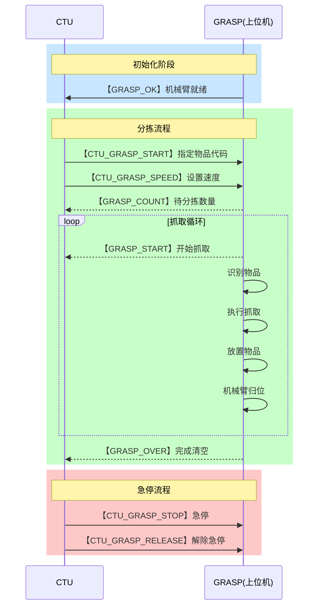
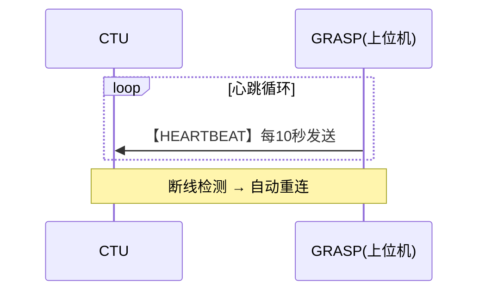

# CTU通信协议技术方案

## 一、技术方向概述

### 1.1 系统定位
基于TCP/IP的**二进制自定义协议**，实现CTU（中央控制单元）与上位机（Jetson Orin NX）之间的高效、可靠通信。

### 1.2 核心技术特点
| 特性 | 技术方案 |
|------|---------|
| **传输协议** | TCP/IP（面向连接、可靠传输） |
| **数据格式** | 二进制帧结构（紧凑、高效） |
| **校验机制** | CRC16-Modbus（多项式0xA001） |
| **通信模式** | 双向异步通信 + 心跳保活 |
| **错误处理** | 状态码 + 自动重连 |

### 1.3 技术优势
- **低延迟**：TCP_NODELAY禁用Nagle算法，减少小数据包延迟
- **高可靠**：CRC16校验 + 自动重连机制
- **易扩展**：模块化命令字设计，便于新增功能
- **强兼容**：支持SLAM导航与机械臂分拣双场景

---

## 二、通信协议架构

### 2.1 网络拓扑

```
┌─────────────────────────────────────────────────────────┐
│                     CTU (192.168.127.253:8899)          │
│                    中央控制单元                          │
└────────────────────┬────────────────────────────────────┘
                     │ TCP/IP
                     │
        ┌────────────┴────────────┐
        │                         │
┌───────▼────────┐      ┌────────▼────────┐
│  上位机(有线)   │      │  上位机(无线)   │
│ 192.168.127.102│      │  192.168.2.51   │
│ Jetson Orin NX  │      │  (CMCC-92FZ)   │
└────────┬────────┘      └─────────────────┘
         │
    ┌────┴────┐
    │         │
┌───▼───┐ ┌──▼──────┐
│ SLAM  │ │  GRASP  │
│ 导航  │ │  分拣   │
└───────┘ └─────────┘
```

### 2.2 协议帧结构

```
┌─────────────────────────────────────────────────────────┐
│                     数据帧结构                           │
├─────────────────────────────────────────────────────────┤
│                                                         │
│  ┌──────┬──────┬────────────────────────┬──────────┐  │
│  │ SOF  │ LEN  │       DATA            │  CRC16   │  │
│  │ 2B   │ 2B   │       N Bytes         │   2B     │  │
│  └──────┴──────┴────────────────────────┴──────────┘  │
│                                                         │
│  ┌─────────────────────────────────────────────────┐  │
│  │              DATA 段结构（可重复）               │  │
│  ├─────────────────────────────────────────────────┤  │
│  │  ┌────┬──────┬──────────┬────┐                 │  │
│  │  │SOD │ CMD  │  DATA    │EOD │                 │  │
│  │  │1B  │ 1B   │  N Bytes │1B  │                 │  │
│  │  └────┴──────┴──────────┴────┘                 │  │
│  └─────────────────────────────────────────────────┘  │
│                                                         │
└─────────────────────────────────────────────────────────┘

SOF:  0x55 0xAA (帧开始标志)
LEN:  数据段长度（小端序）
SOD:  0xA5 (数据段开始)
CMD:  命令字
DATA: 数据内容（可选）
EOD:  0x5A (数据段结束)
CRC:  CRC16校验（小端序）
```

---

## 三、命令字定义

### 3.1 机械臂分拣指令（CTU → 上位机）

| 命令字 | 值 | 数据长度 | 数据类型 | 功能说明 |
|--------|-----|---------|---------|---------|
| **CTU_GRASP_START** | 0x70 | 4 | uint32 | 开始分拣，指定物品代码 |
| **CTU_GRASP_SPEED** | 0x71 | 1 | uint8 | 分拣速度【0-100】 |
| **CTU_GRASP_STOP** | 0x78 | - | - | 进入急停状态 |
| **CTU_GRASP_RELEASE** | 0x79 | - | - | 解除急停状态 |

**物品代码映射：**
```
1 → soap (肥皂)
2 → interrupter (空气开关)
3 → terminal (接线端子)
4 → limit (限位开关)
5 → voltage (电压采集模块)
```

### 3.2 分拣状态反馈（上位机 → CTU）

| 命令字 | 值 | 数据长度 | 数据类型 | 功能说明 |
|--------|-----|---------|---------|---------|
| **GRASP_COUNT** | 0x80 | 1 | uint8 | 发送待分拣物品数量 |
| **GRASP_START** | 0x81 | - | - | 机械臂开始执行抓取 |
| **GRASP_OVER** | 0x82 | - | - | 机械臂完成料箱清空并归位 |

### 3.3 系统自检指令

| 命令字 | 值 | 数据长度 | 功能说明 |
|--------|-----|---------|---------|
| **HEARTBEAT** | 0x99 | - | 心跳保活（10秒间隔） |
| **SLAM_OK** | 0xE0 | - | SLAM初始化完成标志 |
| **SLAM_ERR** | 0xE1 | 1 | SLAM系统错误（后接错误码） |
| **GRASP_OK** | 0xF0 | - | 机械臂初始化完成标志 |
| **GRASP_ERR** | 0xF1 | 1 | 机械臂系统错误（后接错误码） |

### 3.4 错误码定义

#### SLAM错误码（0xE1）
| 错误码 | 错误名 | 说明 |
|--------|--------|------|
| 0x00 | UNKNOWN_ERR | 未知错误 |
| 0x01 | LIDAR_OPEN_ERR | 雷达打开失败 |
| 0x02 | IMU_NOT_FOUND | IMU未找到 |

#### 机械臂错误码（0xF1）
| 错误码 | 错误名 | 说明 |
|--------|--------|------|
| 0x00 | UNKNOWN_ERR | 未知错误 |
| 0x01 | CAMERA_NOT_CONNECTED | 相机未连接 |
| 0x02 | CAMERA_OPEN_ERR | 相机打开失败 |
| 0x03 | ROBOT_NOT_CONNECTED | 机械臂未连接 |
| 0x04 | GRIPPER_NOT_CONNECTED | 夹爪未连接 |

---

## 四、通信流程

### 4.1 分拣流程时序图



### 4.2 心跳保活机制



---

## 五、技术路线

### 5.1 协议设计路线

```
需求分析 → 协议定义 → 编解码实现 → 通信测试 → 优化迭代
    ↓           ↓           ↓           ↓           ↓
  功能梳理   帧结构设计   CRC校验    压力测试    性能调优
  场景划分   命令字定义   异常处理   兼容性测试  稳定性提升
```

### 5.2 实现技术栈

| 层次 | 技术选型 |
|------|---------|
| **传输层** | TCP/IP Socket |
| **协议层** | 自定义二进制协议 |
| **校验层** | CRC16-Modbus (0xA001) |
| **编码层** | Python struct模块 |
| **并发层** | 多线程（心跳+监听） |
| **容错层** | 自动重连 + 指数退避 |

### 5.3 关键技术点

#### 5.3.1 CRC16校验算法
```python
# CRC16-Modbus多项式：0xA001
_crc = 0xFFFF
for byte in data:
    _crc ^= byte
    for _ in range(8):
        if _crc & 0x0001:
            _crc = (_crc >> 1) ^ 0xA001
        else:
            _crc >>= 1
```

#### 5.3.2 TCP_NODELAY优化
```python
# 禁用Nagle算法，减少小数据包延迟
sock.setsockopt(socket.IPPROTO_TCP, socket.TCP_NODELAY, 1)
```

#### 5.3.3 自动重连机制
```python
# 指数退避策略：1s → 2s → 4s → ... → 30s
reconnect_interval = min(reconnect_interval * 2, max_interval)
```

---

## 六、性能指标

| 指标 | 目标值 |
|------|--------|
| **通信延迟** | < 100ms |
| **心跳间隔** | 10秒 |
| **重连间隔** | 1~30秒（指数退避） |
| **单次抓取时间** | < 5秒 |
| **系统启动时间** | < 30秒 |
| **协议开销** | 4字节帧头 + 2字节CRC |

---

## 七、扩展性设计

### 7.1 命令字预留空间
- `0x00-0x6F`: SLAM导航指令
- `0x70-0x7F`: 机械臂分拣指令
- `0x80-0x8F`: 分拣状态反馈
- `0xE0-0xEF`: SLAM系统指令
- `0xF0-0xFF`: 机械臂系统指令

### 7.2 未来扩展方向
1. **多机械臂协同**：扩展命令字支持多设备控制
2. **实时数据流**：增加视频流、点云流传输通道
3. **安全认证**：增加身份认证和加密机制
4. **远程调试**：增加调试指令和日志回传功能

---

## 八、总结

### 8.1 技术亮点
- ✅ **高效可靠**：二进制协议 + CRC16校验
- ✅ **实时性强**：TCP_NODELAY + 心跳保活
- ✅ **容错性好**：自动重连 + 错误码机制
- ✅ **易维护**：模块化设计 + 清晰的命令字定义

### 8.2 应用价值
- 支持CTU设备智能分拣任务
- 实现机械臂精准抓取控制
- 提供完整的系统自检机制
- 为未来多场景扩展奠定基础
